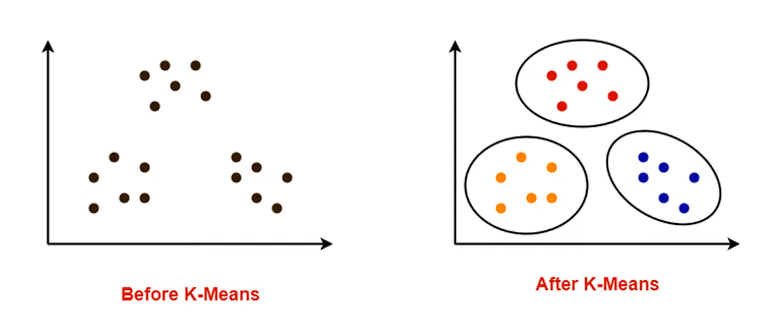
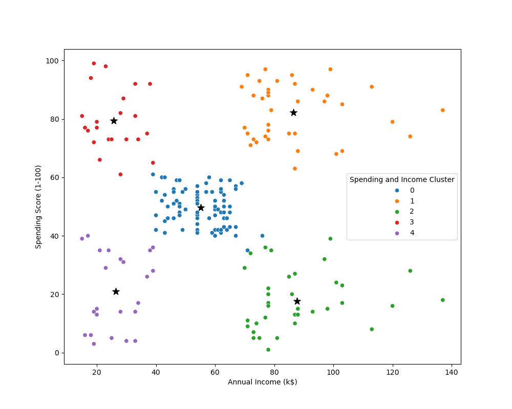

# Customer_Segmentation_And_Clustering

# Segment Shopping Customers

## Problem Statement
- **Understand the Target Customers** for the marketing team to plan a strategy.

## Context
- Your boss wants you to identify the most important shopping groups based on **income**, **age**, and the **mall shopping score**.  
- He wants the ideal number of groups with a label for each.

## Objective: Market Segmentation
- Divide your mall target market into approachable groups.  
- Create subsets of a market based on **demographics** and **behavioral criteria** to better understand the target for marketing activities.

## The Approach
To achieve this, the following **four-step workflow** has been outlined:

1. **Exploratory Data Analysis (EDA)**: Perform quick initial analysis to understand the data distribution.  
2. **K-Means Clustering**: Utilize this algorithm to mathematically define the customer segments.  
3. **Summary Statistics**: Analyze the specific characteristics (mean income, average age, etc.) of each resulting cluster.  
4. **Visualization**: Create charts to clearly communicate the findings.

-   

## Analysis

### Target Cluster
- **Target group** would be **Cluster 1**, which has a **high Spending Score** and **high income**.  
- 54 percent of Cluster 1 shoppers are women. We should look for ways to attract these customers using a marketing campaign targeting popular items in this cluster.  
- **Cluster 2** presents an interesting opportunity to market to the customers for sales events on popular items.

## Visualizations
-   

